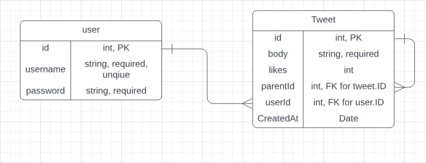

# Online Live Social Media App - Frontend React Application

## Overview

This project is a Frontend React application for an online Cloud-hosted Live Social Media application where users can create accounts and post tweets and receive tweets in real time. There will be an integrated Weather API as a Frontend feature. Tweets and user information will be hosted on the cloud and accessed across the web via an Azure SQL Database. The focus is on building a functional and fluid frontend with **React** and **Tailwind**.

## Demo App

https://white-island-0a58c890f.4.azurestaticapps.net/

## API Repository

https://github.com/241209-NET/Team6-Backend

## MVP Features

- Create and retrieve users.
- Post, retrieve, like, unlike, and reply to tweets.
- Interact with the application in real-time via SignalR websockets.
- Frontend features: User Login, Tweet Home Page, Weather API integration.

## External API

MyMemory API - Assisted with franc and iso-693-3-to-1

## Project Management

Github Projects

## Tech Stack

- **Backend**: ASP.NET Core Web API, Entity Framework Core, C#, LINQ.
- **Database**: SQL Server (Cloud hosted using Azure).
- **Frontend**: React, Vite, TailwindCSS, Shadcn/ui, Typescript
- **Testing**: xUnit.

## ERD

## Stretch Features

- Authentification && Authorization
